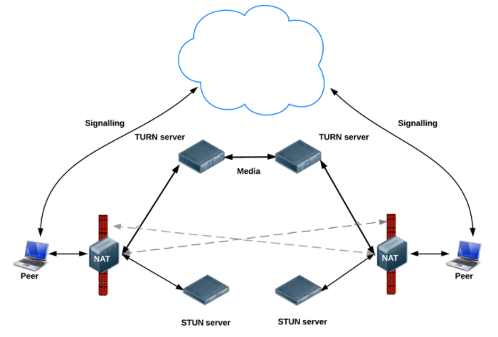

## WebRTC

[WebRTC](https://webrtc.org/)是一项革命性的技术.其[api](http://w3c.github.io/webrtc-pc/))可以点击查阅.

webRTC除了控制摄像头麦克风,更关键的特性是支持p2p通信,类`RTCPeerConnection`就是处理p2p连接的类,
`RTCPeerConnection([configuration])`

我们可以创建的时候加入设置,也可以创建后用`.setConfiguration(restartConfig)`方法来设置这个连接,比较重要的是`iceServers`这个参数,用来穿过防火墙

```ts
{
    'iceServers': [{'url': 'stun:23.21.150.121'}]
}

{
    'optional': [{'DtlsSrtpKeyAgreement': true}]
}
```
完成这个配置之后就是为通道创建端点连接了.一根管道当然是有两个端点,所以肯定会要有两个RTCPeerConnection的实例,本机一端叫localConnection,另一机一端叫remoteConnection

连接实例可以有事件绑定

+ onaddstream 连接上添加了流
+ onconnectionstatechange 连接状态改变
+ ondatachannel 当RTCDataChannel由调用createDataChannel（）的远程对等体添加到连接时，会发送类型为RTCDataChannelEvent的此事件。
+ onicecandidate  每当本地ICE代理需要通过信令服务器将消息递送到另一对等体时发生。
+ oniceconnectionstatechange 当由iceConnectionState属性表示的连接的ICE代理的状态发生变化时，会发生这种情况。
+ onicegatheringstatechange 当ICE收集状态（即，ICE代理是否主动收集候选项）时发生这种情况。
+ onidentityresult 当生成身份断言时，通过getIdentityAssertion（）或在提供或回答的创建期间发送此类事件
+ onidpassertionerror 当相关联的身份提供商（IdP）在生成身份断言时遇到错误时，发送这样的事件。
+ onidpvalidationerror 当相关联的身份提供商（IdP）在验证身份断言时遇到错误时，发送这样的事件。
+ onnegotiationneeded 当发生需要进行会话协商的更改时，会触发此事件。
+ onpeeridentity  当从对等体接收到的身份断言已经被成功验证时，发送这样的事件。
+ onremovestream 当从此连接中删除MediaStream时，将发送此类事件。
+ onsignalingstatechange 当RTCPeerConnection.signalingState的值更改时，作为调用setLocalDescription（）或setRemoteDescription（）的结果，将发送此事件。
+ ontrack 当创建了新的传入MediaStreamTrack并与已在连接时添加到该组接收器的RTCRtpReceiver对象相关联时，会发送此事件。


我们要让两端可以通信,除了要建立连接,还要在同一个频道,RTCPeerConnection的实例的`.createDataChannel(channelname[,option])`方法就是用来创建频道,一般都是在本机端创建频道,频道可以有

`.onopen`和`.onclose`两个事件绑定

而另一机一端则是并不需要,但一般要设置`ondatachannel`来确认通道建立成功


接着我们需要两个端点都有有icecandidate,就用刚才的事件绑定`onicecandidate`:

```js
localConnection.onicecandidate = e => !e.candidate
    || remoteConnection.addIceCandidate(e.candidate)
    .catch(handleAddCandidateError)
```
另一端也是一样,IceCandidate需要两边都有

有了连接,有了通道,还要为两端找到标识,这样才能两边建立连通的连接.`RTCSessionDescription`就是这个标识

`localConnection.createOffer()`可以产生一个offer
,也就是一个包含元数据信息的`RTCSessionDescription`的promise,接着我们可以拿这个offer来设置为本机的SessionDescription

`localConnection.setLocalDescription(offer)`


所谓SessionDescription就是一组对连接的唯一表示元数据,包括`RTCSessionDescription.type`和`RTCSessionDescription.sdp`两部分,可以用`.toJSON()`方法获得json数据

每个端点都必须要知道自己的唯一标识和对面的唯一标识,
我们本地的连接有了自己的唯一标识,但还不知道对面的唯一标识,这时候就需要一个服务器来传递这个标识到另一端,而另一端则要先用`.setRemoteDescription(offer)`记录自己对面的标识,之后使用`remoteConnection.createAnswer()`来创建回应的`RTCSessionDescription`,并将之设置为自己的标识`.setLocalDescription(answer)`,然后再把这个answer传回给之前的端点连接

这个用来转发标识的服务器就是所谓的发信服务器了.事实上发信服务器只是一个简单的消息传递,数据传递是p2p的.发信服务器没有限制,只要能发能收就可以了我们完全可以用socketio来实现.当然了,实际上只要能交换就行,因此不通过服务器,而是通过其他比如im呀,邮件呀,人肉呀的方法也是完全可以的.


这样就可以用浏览器实现直播,视频通话之类的功能,这样一些原本只能通过客户端实现的功能了



### 建立连接的顺序

webrtc的连接建立非常看重操作顺序,这个顺序是:
1. 创建端点`RTCPeerConnection`
2. 创建`channel`,这时我们设置的ice服务器就可以触发让我们获得`IceCandidate`的事件
3. 两端通过发信服务器相互交换`IceCandidate`并互设彼此为`IceCandidate`,用`addIceCandidate()`方法
3. 创建offer获取本机`RTCSessionDescription`,并设置为本机的`LocalDescription`,之后通过发信服务器发送给对面
4. 对面接收到本机offer后将之设为`RemoteDescription`,然后在创建`answer`,并设为`LocalDescription`,之后再将`answer`通过发信服务器发送回本机
5. 或得到`answer`后将之设置为本机的`RemoteDescription`

这样就连通好了.

### 发信服务器

我们可以用socketio来建立发信服务器,毕竟它自带room功能.一个发信服务器应该有如下几个接口:

+ `offer`:用来将`offer`传出
+ `answer`: 用来将`answer`传回
+ `candidate`:用来交换`candidate`

其他的就自由发挥了


### 消息传递

消息传递只需要使用DataChannel的send方法即可

### 文件传递

这个例子是传递文件,文件已经有了html5支持,要传输我们只要设置channel的`binaryType = 'arraybuffer'`即可,之后只要把用`reader.readAsArrayBuffer(f)`读出的数据直接发送过去就行了,为了显示,我先将文件信息传了过去,这样就好显示了.

后续还可以加入md5检验,有兴趣的可以自己实现

### 多媒体传递

如果是视屏通讯的话,我们甚至不用借助channel的send方法,只要在各端使用`addStream`添加流,并且各端监听`onaddstream`事件即可

### 复杂多端对等网

基础的p2p只是两端的通信,而如果要多端通信就应该要考虑结构问题了

+ 全连结构

全连结构就是所有节点都相连,在节点不多的情况下还是可以的,但问题在于每个节点的带宽要求都很高,如果带宽小或者链接过多就会效果很不好

+ 星型结构

星型结构是以一个节点作为中心,与所有节点建立联系,而其他各个节点间都没有联系.这种方式可以用来做直播,对中心节点的带宽有很高的要求.

+ 环状结构

环状结构的话每个节点都只有俩个链接,信息在这个圆环中按一个顺序流动,这种方式对带宽要求不高,但一旦有节点要退出,那么处理起来会比较麻烦.而且每个节点必须本地维护一个自身id,这样才能够比较容易的被找到.

+ 使用服务器作为路由

虽然是p2p通信,但为了找到要连接的人往往还是要依靠一个服务器,因此,完全可以在服务器端维护一个各个节点的状态表,由这个服务器来辅助动态的建立连接.

### 无服务器p2p

一个值得注意的demo是<https://github.com/cjb/serverless-webrtc>,这个项目实现了除了需要一个用于找出本机ip的外不再需要服务器,实现真正p2p的效果,相当IMBA.

其实原理很简单,我们从建立连接的顺序可以看出,webrtc通信只是要两端交换`RTCSessionDescription`和`IceCandidate`而已,因此完全可以将这两个信息通过其他途径,比如邮件,比如im来传递即可.

基本的步骤可以是:
1. 将本机的offer和IceCandidate信息以固定格式比如json的形式输出为字符串
2. 将这个输出的字符串发给要连线的人
3. 对方解析这个字符串,将之设置好后获取自己的`answer`和`IceCandidate`,然后再传回给本机
4. 本机解析好对面传来的信息,然后对应的设置好

### 与服务器p2p连接

如果要组星型网络,那么势必需要一台中心节点,一般的机器恐怕无法应付,因此,可能更好的方法是让服务器来作为中心节点,node上可用的webrtc<https://github.com/js-platform/node-webrtc>可以在github上找到,但版本比较低,可能需要编译安装.


使用它的话就可以在服务器上运行一个进程直接交互了
